# BlueWork — Entity Relationship Diagram

```mermaid
erDiagram

    %% ─────────────────────────────────────────
    %% USERS & PROFILES
    %% ─────────────────────────────────────────

    users {
        uuid        id              PK
        user_role   role
        varchar     name
        varchar     email
        varchar     phone
        varchar     password_hash
        user_status status
        timestamptz created_at
        timestamptz updated_at
        timestamptz deleted_at
    }

    customers {
        uuid    user_id         PK  "FK → users"
        text    default_address
        decimal default_lat
        decimal default_lng
    }

    workers {
        uuid                    user_id              PK  "FK → users"
        worker_availability     availability_status
        decimal                 current_lat
        decimal                 current_lng
        timestamptz             location_updated_at
        decimal                 rating
        int                     completed_jobs_count
        timestamptz             approved_at
        uuid                    approved_by              "FK → users (admin)"
    }

    worker_skills {
        uuid        id          PK
        uuid        worker_id   "FK → workers"
        varchar     category
        timestamptz created_at
    }

    %% ─────────────────────────────────────────
    %% JOBS
    %% ─────────────────────────────────────────

    job_categories {
        uuid    id          PK
        varchar slug
        varchar label
        text    icon_url
        boolean is_active
    }

    jobs {
        uuid        id                  PK
        uuid        customer_id             "FK → users"
        uuid        worker_id               "FK → workers (nullable)"
        varchar     category                "FK → job_categories.slug"
        text        description
        text        location_address
        decimal     location_lat
        decimal     location_lng
        job_urgency urgency
        timestamptz scheduled_at
        job_status  status
        text        cancellation_reason
        uuid        cancelled_by            "FK → users (nullable)"
        timestamptz created_at
        timestamptz accepted_at
        timestamptz en_route_at
        timestamptz started_at
        timestamptz completed_at
        timestamptz cancelled_at
    }

    job_photos {
        uuid        id              PK
        uuid        job_id              "FK → jobs"
        text        url
        uuid        uploaded_by         "FK → users"
        timestamptz uploaded_at
    }

    job_status_history {
        uuid        id              PK
        uuid        job_id              "FK → jobs"
        job_status  from_status
        job_status  to_status
        uuid        changed_by          "FK → users"
        text        note
        timestamptz created_at
    }

    %% ─────────────────────────────────────────
    %% PAYMENTS & REFUNDS
    %% ─────────────────────────────────────────

    payments {
        uuid            id                      PK
        uuid            job_id                      "FK → jobs (unique)"
        uuid            customer_id                 "FK → users"
        uuid            worker_id                   "FK → users"
        payment_method  method
        decimal         amount
        char            currency
        payment_status  status
        varchar         gateway_transaction_id
        text            payment_url
        timestamptz     cash_confirmed_at
        timestamptz     expires_at
        timestamptz     paid_at
        timestamptz     created_at
        timestamptz     updated_at
    }

    refunds {
        uuid        id                  PK
        uuid        payment_id              "FK → payments"
        decimal     amount
        text        reason
        uuid        issued_by               "FK → users (admin)"
        varchar     gateway_refund_id
        varchar     status
        timestamptz created_at
    }

    %% ─────────────────────────────────────────
    %% DISPUTES
    %% ─────────────────────────────────────────

    disputes {
        uuid            id              PK
        uuid            job_id              "FK → jobs (unique)"
        uuid            raised_by           "FK → users"
        text            reason
        dispute_status  status
        text            resolution
        dispute_action  action
        uuid            resolved_by         "FK → users (admin, nullable)"
        timestamptz     created_at
        timestamptz     updated_at
        timestamptz     resolved_at
    }

    dispute_photos {
        uuid        id              PK
        uuid        dispute_id          "FK → disputes"
        text        url
        uuid        uploaded_by         "FK → users"
        timestamptz uploaded_at
    }

    %% ─────────────────────────────────────────
    %% COMMUNICATION
    %% ─────────────────────────────────────────

    messages {
        uuid        id          PK
        uuid        job_id          "FK → jobs"
        uuid        sender_id       "FK → users"
        text        content
        timestamptz sent_at
    }

    notifications {
        uuid                id          PK
        uuid                user_id         "FK → users"
        notification_type   type
        varchar             title
        text                body
        jsonb               payload
        boolean             read
        timestamptz         read_at
        timestamptz         created_at
    }

    %% ─────────────────────────────────────────
    %% AUTH TOKENS & DEVICES
    %% ─────────────────────────────────────────

    otp_codes {
        uuid        id          PK
        varchar     phone
        varchar     code_hash
        boolean     used
        timestamptz expires_at
        timestamptz created_at
    }

    password_reset_tokens {
        uuid        id          PK
        uuid        user_id         "FK → users"
        varchar     token_hash
        boolean     used
        timestamptz expires_at
        timestamptz created_at
    }

    refresh_tokens {
        uuid        id          PK
        uuid        user_id         "FK → users"
        varchar     token_hash
        boolean     revoked
        timestamptz expires_at
        timestamptz created_at
    }

    device_tokens {
        uuid            id          PK
        uuid            user_id         "FK → users"
        text            token
        device_platform platform
        timestamptz     created_at
    }

    %% ─────────────────────────────────────────
    %% TRACKING & AUDIT
    %% ─────────────────────────────────────────

    worker_location_logs {
        uuid        id          PK
        uuid        worker_id       "FK → workers"
        uuid        job_id          "FK → jobs (nullable)"
        decimal     lat
        decimal     lng
        timestamptz recorded_at
    }

    audit_logs {
        uuid        id          PK
        uuid        actor_id        "FK → users (admin)"
        varchar     action
        varchar     target_type
        uuid        target_id
        jsonb       metadata
        timestamptz created_at
    }

    %% ─────────────────────────────────────────
    %% RELATIONSHIPS
    %% ─────────────────────────────────────────

    %% User profiles
    users           ||--o|   customers               : "has"
    users           ||--o|   workers                 : "has"
    workers         ||--o{   worker_skills            : "has"

    %% Jobs
    users           ||--o{   jobs                    : "posts (customer)"
    workers         ||--o{   jobs                    : "assigned to"
    job_categories  ||--o{   jobs                    : "categorises"
    jobs            ||--o{   job_photos              : "has"
    jobs            ||--o{   job_status_history      : "tracks"

    %% Payments
    jobs            ||--o|   payments                : "billed via"
    payments        ||--o{   refunds                 : "may have"

    %% Disputes
    jobs            ||--o|   disputes                : "may raise"
    disputes        ||--o{   dispute_photos          : "evidenced by"

    %% Communication
    jobs            ||--o{   messages                : "has chat"
    users           ||--o{   notifications           : "receives"

    %% Auth
    users           ||--o{   refresh_tokens          : "holds"
    users           ||--o{   password_reset_tokens   : "resets via"
    users           ||--o{   device_tokens           : "registered on"

    %% Tracking & Audit
    workers         ||--o{   worker_location_logs    : "pings"
    jobs            ||--o{   worker_location_logs    : "during"
    users           ||--o{   audit_logs              : "actor in"
```

---

## Relationship Summary

| Relationship | Type | Notes |
|---|---|---|
| `users` → `customers` | 1-to-0..1 | Only exists for customer-role users |
| `users` → `workers` | 1-to-0..1 | Only exists for worker-role users |
| `workers` → `worker_skills` | 1-to-many | A worker can list multiple skill categories |
| `job_categories` → `jobs` | 1-to-many | Slug stored denormalised on job row |
| `users` → `jobs` (customer) | 1-to-many | A customer can post many jobs |
| `workers` → `jobs` | 1-to-many | A worker can be assigned to many jobs over time |
| `jobs` → `job_photos` | 1-to-many | Up to 5 photos per job |
| `jobs` → `job_status_history` | 1-to-many | Every status transition is logged |
| `jobs` → `payments` | 1-to-0..1 | One payment per job |
| `payments` → `refunds` | 1-to-many | Partial refunds allowed |
| `jobs` → `disputes` | 1-to-0..1 | One active dispute per job |
| `disputes` → `dispute_photos` | 1-to-many | Evidence from either party |
| `jobs` → `messages` | 1-to-many | In-job chat thread |
| `users` → `notifications` | 1-to-many | Push notification history |
| `users` → `refresh_tokens` | 1-to-many | Multi-device sessions |
| `users` → `device_tokens` | 1-to-many | Multiple devices per user |
| `workers` → `worker_location_logs` | 1-to-many | GPS history, pruned after 30 days |
| `jobs` → `worker_location_logs` | 1-to-many | Location pings scoped to a job |
| `users` → `audit_logs` | 1-to-many | Admin action trail |

---

## Notes

- **`otp_codes`** links via `phone` string, not a FK — phone may belong to a not-yet-registered user during the signup flow.
- **`workers.approved_by`** and **`disputes.resolved_by`** are self-referencing FKs back to `users` (admin role).
- **`jobs.category`** is stored as a denormalised `varchar` slug so job history survives even if a category is deactivated.
- **`worker_location_logs`** is a high-volume table — schedule a purge job to delete rows older than 30 days.
